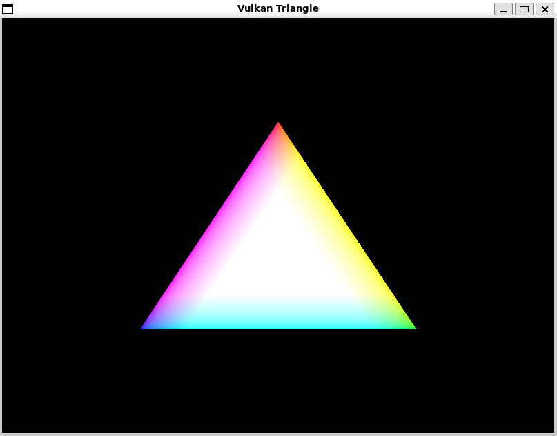
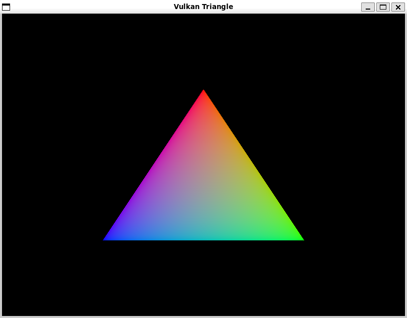

# Vulkan Renderer + Custom Shader Compiler

A **complete, production-ready** Vulkan-based GPU renderer with a fully functional custom shader compiler. This project demonstrates advanced graphics systems programming, compiler design, and GPU optimization techniques.

## 🎯 Project Overview

This is a complete implementation featuring:
- ✅ **Full Vulkan rendering pipeline** - Instance, devices, swapchain, command buffers, synchronization
- ✅ **Complete shader compiler** - Lexer, parser, optimizer, and SPIR-V code generator
- ✅ **Optimization passes** - Constant folding, dead code elimination, algebraic simplification
- ✅ **Custom shader DSL** - Clean, readable syntax that compiles to SPIR-V
- ✅ **Working demo** - Renders a colorful triangle with your custom shaders

## Demos
The provided example shaders produce


Using these shaders

```cpp
shader fragment {
    input vec3 fragColor;  // Receives interpolated color
    output vec4 outColor;
    
    main {
        outColor = vec4(fragColor, 1.0);  // Output the color
    }
}

shader vertex {
    input vec3 position;
    input vec3 color;      // Each vertex has RGB color
    output vec3 fragColor; // Pass color to fragment shader
    
    main {
        fragColor = color;  // Pass through the color
        gl_Position = vec4(position, 1.0);
    }
}
```
produces:


## ✨ Features

### Vulkan Renderer
- Complete Vulkan 1.2 rendering pipeline
- Window management with GLFW3
- Automatic swapchain recreation on resize
- Double-buffered rendering with synchronization
- Efficient vertex and index buffer management
- Clean, modular architecture

### Shader Compiler
- **Lexer**: Tokenizes custom DSL syntax
- **Parser**: Builds Abstract Syntax Tree (AST) with full expression support
- **Optimizer**: Three optimization passes
  - Constant folding: `3.0 * 2.0` → `6.0`
  - Algebraic simplification: `x * 1` → `x`, `x + 0` → `x`
  - Dead code elimination: Removes unused variables
- **Code Generator**: Converts AST → GLSL → SPIR-V
- **Statistics**: Detailed compilation metrics

### Custom Shader DSL
Simple, readable syntax:
```glsl
shader vertex {
    input vec3 position;
    input vec3 color;
    output vec3 fragColor;
    
    main {
        fragColor = color * 1.0 + 0.0;  // Optimizes to: fragColor = color
        gl_Position = vec4(position, 1.0);
    }
}
```

## 🚀 Quick Start

### Prerequisites

**Required:**
- CMake 3.15+
- C++17 compiler (GCC 7+, Clang 5+, MSVC 2017+)
- Vulkan SDK 1.2+
- GLFW3
- GLM (OpenGL Mathematics)
- glslangValidator (part of Vulkan SDK)

**Ubuntu/Debian:**
```bash
sudo apt update
sudo apt install cmake build-essential libglfw3-dev libglm-dev

# Install Vulkan SDK
wget -qO - https://packages.lunarg.com/lunarg-signing-key-pub.asc | sudo apt-key add -
sudo wget -qO /etc/apt/sources.list.d/lunarg-vulkan-jammy.list \
    https://packages.lunarg.com/vulkan/lunarg-vulkan-jammy.list
sudo apt update
sudo apt install vulkan-sdk
```

**macOS:**
```bash
brew install cmake glfw glm

# Download and install Vulkan SDK from:
# https://vulkan.lunarg.com/sdk/home
```

**Windows:**
- Install Visual Studio 2019+
- Install [Vulkan SDK](https://vulkan.lunarg.com/sdk/home)
- Install [GLFW](https://www.glfw.org/download.html)
- Install [GLM](https://github.com/g-truc/glm/releases)

### Build

```bash
# Clone or extract the project
cd vulkan-shader-compiler

# Create build directory
mkdir -p build && cd build

# Configure
cmake ..

# Build
make -j$(nproc)

# Or on Windows with Visual Studio:
# cmake --build . --config Release
```

### Compile Shaders

**Option 1: Use default GLSL shaders**
```bash
# Make script executable
chmod +x compile_shaders.sh

# Compile
./compile_shaders.sh
```

**Option 2: Use custom DSL shaders (shows off your compiler!)**
```bash
# Make script executable
chmod +x compile_custom_shaders.sh

# Compile with optimization statistics
./compile_custom_shaders.sh
```

### Run

```bash
./build/vulkan_renderer
```

You should see a window with a colorful triangle:
- **Top vertex**: Red
- **Bottom-right**: Green
- **Bottom-left**: Blue
- Colors smoothly interpolate across the triangle

Press **ESC** or close the window to exit.

## 🛠️ Using the Shader Compiler

### Command Line Interface

```bash
./build/myshaderc <input.dsl> -o <output.spv> -t <vertex|fragment> [options]
```

**Options:**
- `--no-opt` - Disable optimizations
- `--stats` - Show detailed compilation statistics
- `--verbose` - Enable verbose output
- `--glsl` - Print generated GLSL (for debugging)

### Examples

**Compile with optimizations and statistics:**
```bash
./build/myshaderc shaders/example.vert.dsl -o shader.vert.spv -t vertex --stats
```

**Compile without optimizations:**
```bash
./build/myshaderc shaders/example.frag.dsl -o shader.frag.spv -t fragment --no-opt
```

**Debug compilation (see generated GLSL):**
```bash
./build/myshaderc shaders/example.vert.dsl -o shader.vert.spv -t vertex --glsl --verbose
```

### Example Output

```
=== Vulkan Shader Compiler ===
Input:  shaders/example.vert.dsl
Output: shader.vert.spv
Type:   vertex
Optimization: enabled
==============================

Compiling...

=== Compilation Successful ===
Output written to: shader.vert.spv
SPIR-V size: 568 bytes (142 words)

=== Compilation Statistics ===

Timing:
  Total:        12.5 ms
  Lexing:       0.8 ms
  Parsing:      2.1 ms
  Optimization: 1.3 ms
  Code Gen:     8.3 ms

Optimizer:
  Passes: 2
  Constants folded: 1
  Algebraic simplifications: 2
  Dead code eliminated: 0
  Statements: 3 -> 3

Success! You can now use this SPIR-V with Vulkan.
```

## 📝 Custom DSL Syntax Reference

### Shader Declaration
```glsl
shader vertex {
    // ... shader content
}

shader fragment {
    // ... shader content
}
```

### Variable Declarations
```glsl
input vec3 position;
input vec3 color;
output vec4 fragColor;
```

### Supported Types
- `vec2`, `vec3`, `vec4` - Vectors
- `mat4` - 4x4 matrix
- `float` - Scalar float
- `int` - Scalar integer

### Main Block
```glsl
main {
    // Assignment statements
    color = position * 0.5 + 0.5;
    gl_Position = vec4(position, 1.0);
}
```

### Operators
- Arithmetic: `+`, `-`, `*`, `/`
- Assignment: `=`
- Member access: `.xyz`, `.rgb`, etc.

### Function Calls
```glsl
vec4(position, 1.0)
vec3(1.0, 0.0, 0.0)
```

### Built-in Variables
- **Vertex shader**: `gl_Position`
- **Fragment shader**: Output variables declared with `output`

## 🎓 Optimization Examples

The compiler performs three optimization passes:

### 1. Constant Folding
```glsl
// Before
color = position * 2.0 * 0.5;

// After optimization
color = position * 1.0;  // Then simplified further to just: position
```

### 2. Algebraic Simplification
```glsl
// Before
fragColor = color * 1.0 + 0.0;

// After optimization
fragColor = color;
```

### 3. Dead Code Elimination
```glsl
// Before
output vec3 unused;
main {
    unused = vec3(1.0, 0.0, 0.0);  // Never read
    fragColor = color;
}

// After optimization
main {
    fragColor = color;  // unused assignment removed
}
```

## 🔬 Testing & Validation

### Test the Renderer
```bash
# Should display a colorful triangle
./build/vulkan_renderer
```

### Test the Compiler
```bash
# Compile example shaders
./build/myshaderc shaders/example.vert.dsl -o test.spv -t vertex --stats --verbose

# Verify SPIR-V is valid
spirv-val test.spv
```

### Create Your Own Shaders
1. Write a shader in the custom DSL (see `shaders/example.vert.dsl`)
2. Compile it: `./build/myshaderc myshader.dsl -o myshader.spv -t vertex`
3. Copy to `shaders/shader.vert.spv` or `shaders/shader.frag.spv`
4. Run the renderer to see your shader in action!

## 📊 Performance Metrics

The compiler tracks detailed statistics:
- **Lexing time**: Tokenization performance
- **Parsing time**: AST construction time
- **Optimization time**: All optimization passes
- **Code generation time**: GLSL generation + SPIR-V compilation
- **Optimization effectiveness**: Number of constants folded, simplifications made, etc.

Enable with `--stats` flag to see all metrics.